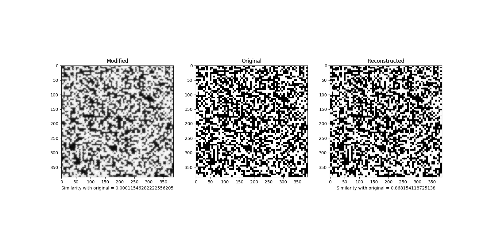

# Readme

The concept is to remove noise from a black and white images. Such as :



## How to run

### Training

The following command will train your neural network from scratch on 10 epochs. On my computer it takes around 40s each epoch :
```bash
glowingspoon --train=True --train_x="my/path/modified" --train_y="my/path/original/"
    --save_nn="model.pth" --epochs=10
```

### Testing

In order to test, you need to specify the testing flag and some images to test. For example :
```bash
glowingspoon --train=False --test=True
    --test_x="/new/path/folder/test/modified/"
    --test_y="/new/path/folder/test/original/"
    --load_nn="model.pth"
    --print_example=True
```

## Remarks

 * By running : 
   ```bash
    glowingspoon --help
    ```
    you will recieve a lot of indication and the default values for each parameters.

 * The measurement is the structural similarity from scikit-learn. The mean value is about 0.80 over the whole images.

## TODO :

 1. cross-validation nor k-fold validation
 2. This isn't a perfect tool, there is a lot of improvement that can be done. It's not very stable and this code is mostly a proof of concept on a "research question".